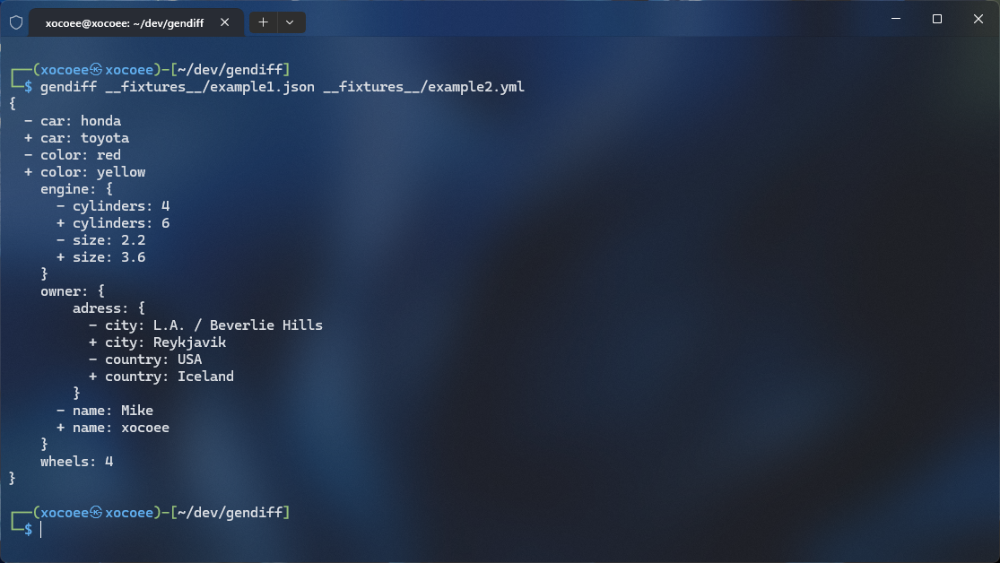
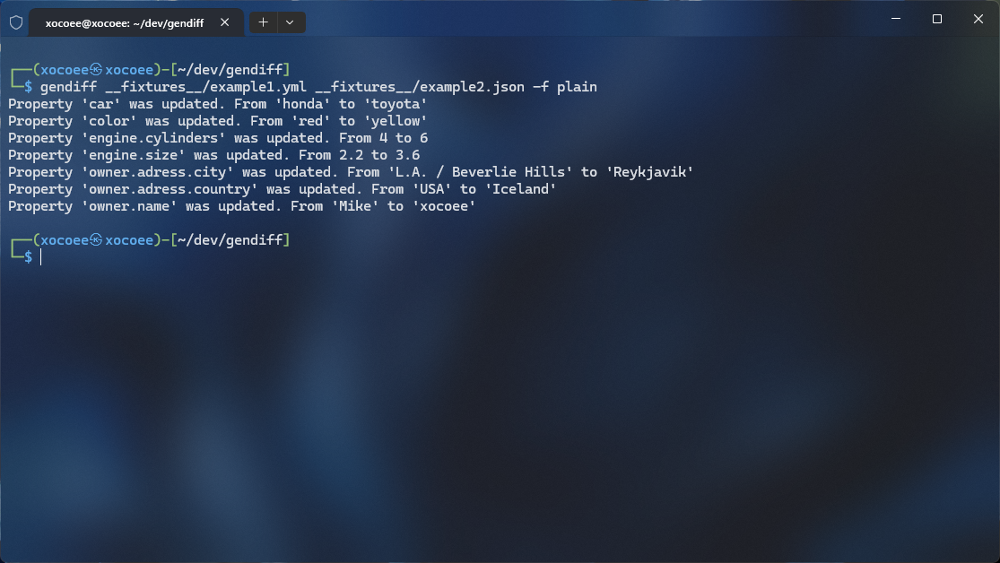

# Project "genDiff"

[](https://codeclimate.com/github/xocoee/frontend-project-46/maintainability)

[](https://codeclimate.com/github/xocoee/frontend-project-46/test_coverage)

## Project Description:

genDiff is a robust command-line tool that allows users to compare two files in JSON or YAML format and generate the output in three distinct formats: stylish, plain, and JSON.

With genDiff, users can effortlessly identify differences between two files, simplifying tasks such as debugging and code maintenance.

## Installation:
```sh
npm install
```
```sh
npm link
```

## Usage:
For a rapid overview of program options, utilize:
```sh
gendiff -h
```

### JSON YML
To compare two files and display the result in stylish format, employ the following command:
```sh
gendiff <filepath1> <filepath2>
```


### Plain
To compare two files and display the result in plain format, use the following command:
```sh
gendiff <filepath1> <filepath2> -f plain
```


### JSON
To compare two files and output the result in JSON format, use the following command:
```sh
gendiff <filepath1> <filepath2> -f json
```

